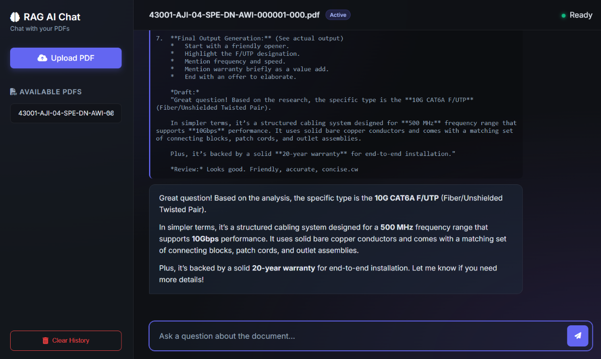

# Dual-AI RAG Chatbot

A transparent Retrieval-Augmented Generation chatbot with a dual-AI architecture that displays every step in real-time within the terminal — similar to how Claude Code displays its thinking and tool use.

## Motivation

The primary goal of this project is to **shorten the context window of a chatbot when interacting with large PDFs**. Feeding an entire PDF into a language model takes up massive amounts of memory, slows down reasoning, and increases API costs or local VRAM usage. This tool solves that by using a dual-AI Retrieval-Augmented Generation (RAG) system that efficiently chunks, retrieves, and feeds only the most relevant context to the model.

## Architecture

```
┌─────────────────────────────────────────────────────────────────┐
│                        USER QUESTION                            │
└─────────────────────────────────────────────────────────────────┘
                              │
                              ▼
┌─────────────────────────────────────────────────────────────────┐
│  Chatbot — Keyword Translation                                  │
│  • Holds conversation history                                   │
│  • Extracts search keywords from question                       │
│  • Tracks previously retrieved chunk IDs                        │
└─────────────────────────────────────────────────────────────────┘
                              │
                              ▼
┌─────────────────────────────────────────────────────────────────┐
│  Researcher — Iterative Retrieval Loop (max 5 iterations)      │
│  ┌─────────────────────────────────────────────────────────┐   │
│  │ Loop 1: Query ChromaDB → Retrieve chunks → Gap analysis │   │
│  │ Loop 2: New keywords → More chunks → Gap analysis       │   │
│  │ ... up to 5 loops until confident or budget exhausted   │   │
│  └─────────────────────────────────────────────────────────┘   │
│  Returns: {answer, confidence, chunks_used, chunk_ids}         │
└─────────────────────────────────────────────────────────────────┘
                              │
                              ▼
┌─────────────────────────────────────────────────────────────────┐
│  Chatbot — Conversational Response                              │
│  • Receives only Researcher's answer (not raw chunks)           │
│  • Generates natural, conversational response                   │
│  • Streams output token-by-token to terminal                    │
└─────────────────────────────────────────────────────────────────┘
```

## Features

- **Transparent Terminal UI**: Every step is displayed in real-time with colors and panels
- **Iterative Reasoning**: Researcher performs gap analysis and decides whether to retrieve more
- **Streaming Output**: Both Researcher thinking and Chatbot responses stream token-by-token
- **Conversation History**: Chatbot maintains context for follow-up questions
- **Source Tracking**: Every retrieved chunk shows document name, page number, and relevance score

## Project Structure

```
rag-chatbot/
├── config.py          # Configuration: API endpoints, models, loop budget
├── ingest.py          # PDF ingestion pipeline (unchanged)
├── Researcher.py      # Researcher: Iterative retrieval and gap analysis
├── Chatbot.py         # Chatbot: Keyword extraction and conversation
├── terminal_ui.py     # Rich terminal display functions
├── main.py            # CLI entry point
├── gui.py             # Web GUI (Flask + Webview)
├── templates/         # Web GUI HTML templates
├── static/            # Web GUI static assets (CSS, JS)
├── requirements.txt   # Python dependencies
├── README.md          # This file
├── pdfs/              # Drop your PDFs here
└── vectorstore/       # ChromaDB persistent storage
```


## Hardware Specifications (Tested On)

The ingestion pipeline is designed to be GPU-accelerated for fast local embeddings. The project has been built and successfully tested on the following system specifications:

- **GPU:** RTX 3060 Laptop Edition (6GB VRAM)
- **RAM:** 16GB DDR4
- **CPU:** AMD Ryzen 9 5900HS with Radeon Graphics

*Note: The system dynamically scales its ingestion batch size based on available VRAM, and gracefully falls back to CPU if no GPU is found.*

## Quick Start

### 1. Install Dependencies

```bash
pip install -r requirements.txt
```

### 2. Add PDFs

Drop your PDF documents into the `pdfs/` directory.

### 3. Ingest Documents

```bash
python ingest.py
```

Options:
- `python ingest.py --reset` — Wipe vectorstore and re-ingest all
- `python ingest.py --list` — List ingested documents
- `python ingest.py path/to/file.pdf` — Ingest a specific PDF

### 4. Start the Chatbot

You can run the chatbot in either the Terminal or using the new Web GUI.

**Web GUI:**
```bash
python gui.py
```
This will launch a modern desktop window (powered by Flask and Webview) where you can upload PDFs, select which document to chat with, and view the AI's real-time reasoning and responses.

### Main Interface


**Terminal UI:**
```bash
python main.py
```

Commands in terminal chat:
- `clear` — Clear conversation history
- `help` — Show help
- `exit` or `quit` — Exit the chatbot

## Terminal UI Example

```
╔══════════════════════════════════════════╗
║  USER QUESTION                           ║
╚══════════════════════════════════════════╝
What are the side effects of ibuprofen?

────────────────────────────────────────────
Chatbot → translating to search keywords...
Keywords: ["ibuprofen", "side effects", "adverse reactions", "NSAIDs"]
Already retrieved: none
────────────────────────────────────────────

┌─ RESEARCHER LOOP 1/5 ────────────────────┐
│ Querying vector DB...                     │
│                                           │
│ CHUNKS RETRIEVED:                         │
│  [1] doc: pharmacology.pdf  p.14          │
│      score: 0.91                          │
│      "Ibuprofen may cause gastric..."     │
│                                           │
│ 🤔 THINKING (gap analysis)...             │
│  > Do I have complete coverage?           │
│  > Missing: cardiovascular risks          │
│  > Decision: need more info               │
└───────────────────────────────────────────┘

┌─ RESEARCHER FINAL ANSWER ────────────────┐
│ Confidence: HIGH   Loops used: 2/5       │
└───────────────────────────────────────────┘

[Researcher streams answer...]

════════════════════════════════════════════
 CHATBOT RESPONSE
════════════════════════════════════════════
Ibuprofen can cause several side effects...
[streamed response]
```

## Configuration

Edit `config.py` to customize:

```python
# API server
API_BASE_URL = "http://localhost:8000"

# Researcher (Qwen3 with thinking mode)
RESEARCHER_MODEL = "qwen-3.5vl-Q4-thinking"
RESEARCHER_MAX_TOKENS = 4096
RESEARCHER_TEMPERATURE = 0.0  # Deterministic for reasoning

# Chatbot
CHATBOT_MODEL = "qwen-3.5vl-Q4-thinking"
CHATBOT_MAX_TOKENS = 2048
CHATBOT_TEMPERATURE = 0.7  # More creative for conversation

# Loop budget
LOOP_BUDGET = 5  # Max reasoning iterations per question

# Retrieval
TOP_K = 8  # Chunks per retrieval
```

## How It Works

### Researcher

1. Receives user question + keywords from Chatbot + excluded chunk IDs
2. Queries ChromaDB for relevant chunks
3. Performs gap analysis in thinking mode (`<think>...</think>` tags)
4. Decides: continue retrieval or answer
5. Returns structured JSON: `{answer, confidence, gaps, need_more, loops_used}`

### Chatbot


1. **Keyword Translation**: Converts user questions into search keywords
2. **Conversation Management**: Maintains full conversation history
3. **Response Generation**: Takes Researcher's answer and generates natural conversation
4. **Streaming**: Outputs token-by-token to terminal

### Terminal UI

- **Colors**: Cyan for accents, green for success, yellow for warnings, red for errors
- **Panels**: Rich library creates bordered sections for each step
- **Streaming**: Real-time token output from both AIs
- **Thinking Display**: Researcher's `<think>` content shown in dim grey italic

## Web GUI Features

The new Web UI (`gui.py`) brings the chatbot to a visually stunning interface with:
- **Glassmorphism Design**: Modern, responsive interface using CSS variables and backdrop filters.
- **Real-Time Streaming**: Both the Researcher's thinking tags and Chatbot's responses stream token-by-token directly into the UI.
- **Interactive PDF Management**: Upload PDFs directly via the UI, track ingestion progress, and selectively query specific documents or the entire knowledge base.
- **Desktop Experience**: Built with pywebview to provide an app-like desktop experience while utilizing web technologies.

## Requirements

- Python 3.10+
- llama-server proxy running at `localhost:8000` (or configured URL)
- PDFs with extractable text (OCR not supported)

## Code Attribution and License

Copyright (c) 2026 ASTRO-5444. This project is licensed under the MIT License. See [`LICENSE`](LICENSE) for full details.
